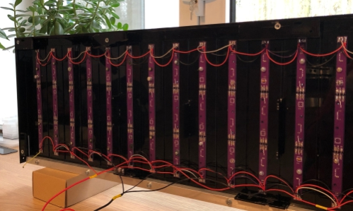
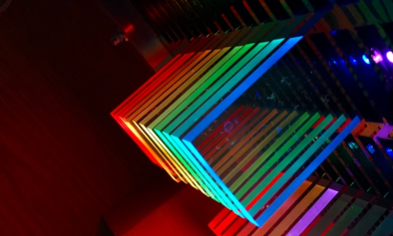

# Audio Spectrum Display 🎧

<p align="center">
  
</p>

The 19 bands (21 height) audio spectrum display built around the ESP32 chip. It process the audio signal from 3.5 mm socket or microphone using FFT and drives the matrix according to the resulting magnitudes - each column of display represent specific frequency content in the signal. The higher the amplitude of specific frequency, the higher the resulting magnitude.

Project is finished and working, but there are some improvents to be done. [Subscribe me on YouTbe](https://www.youtube.com/channel/UCZFgL5xrtGkf4WiEQYAMehw/videos) to be up to date with further updates.

## Content 📦

You will find all you need to DIY your own display:
* ✔️ src/include - source code,
* ✔️ generator - Python code to generate bands bins,
* ✔️ electronics - electronic schematics, calculations, Jupyter Notebook with amplifier simulation,
* ✔️ mechanics - Corel Draw/PDF files to cut your own casing!

## Casing 🖥️

<p align="center">
  
</p>

Casing is made out of laser cut acrylic. 399 LED block are milled, so that light can better disperse.

<p align="center">
  
</p>

## Matrix (WS2812B strip) 🖼️ 

The matrix (or programmable LED strip) is made using individual WS2812B LEDs soldered to custom PCBs. Custom PCBs grants equal spacing and good heat distribution - entire display can draw more than 100 W of power. There exists programmable LEDs strips with slightly higher spacing, which can be less time-consuming solution.

Back side:

<p align="center">
  
</p>

Front side:

<p align="center">
  
</p>

## Electronics 💡

As energy source the 5V/22A power supply was choosen. The ESP32 devmodule is main CPU of this project. So far its ADC is used to sample signal. It is not best option becouse its max frequency reaches 5 ksps - optimal sampling frequency is 40 ksps becouse of Nyquist–Shannon sampling theorem.

<p align="center">
  
</p>

Both cores of ESP32 are used. So far there is no WiFi connection. Tasks distribution:
* core 0 is responsible for samping and the FFT evaluation,
* core 1 is responsible for animation and driving the LEDs. 

The sampling is driven by the timer to achieve stable sampling period.

<p align="center">
  
</p>

399 LEDs are driven synchronously. Based on baud rate, driving all of them takes around 12 ms, so top frequency is 83 Hz (30 is enough).

Preamplifier is built around TDA2822 circuit with 40 dB amplification and trimmed input signal.

## Effects 🔥

The code is split to severa files, where effect.h and effect.cpp are used to create custom effects. Fire effect's function prototype:
```cpp
void fire_effect(const int* bar_heights, const double* bar_thrs, double* energy, CRGB* display_leds, CRGB* base_leds);
```
All those parameters are "tools" used to achieve dynamic effects.

Then handler should be made and placed in function pointers array like this:
```cpp
effect_handler_t fire_effect_handlers[] = {fire_effect};

void setup() {
    Serial.begin(115200);
    FFTHSV_begin();
    FFTHSV_set_effects(fire_effect_handlers, 1);
    FFTHSV_select_effect(0);
    FFTHSV_benchmark_params(10,20000,200,10000);
    FFTHSV_benchmark(false);
}
```
Check my YT channel where I upload updates. If you are interested in this project consider subscribing ✋


<p align="center">
    https://www.youtube.com/watch?v=PZK8QYlz3o4
</p>
<p align="center">
  
</p>

## Do it yourself 🛠️

I was inspired with projects available online. I've made drawings in Corel Draw and have written my custom code based on [ArduinoFFT library](https://github.com/kosme/arduinoFFT). I haven't seen any full code for more advanced processing, so you are free to use it.

<p align="center">
  
</p>

All files are in [mechanics](mechanics) folder. If you want to make your own project based around my drawings, just let me know and show me your work. I'm interested how your project will look like 🤩

<p align="center">
  
</p>

## Plans ✔️

This project is now finished. Now I'm working under more robust solution using STM32 IC. Follow changes in this repo [Spectrum_Audio_Display_V2](https://github.com/Gieneq/Spectrum_Audio_Display_V2)

## Contact 📲

- [Instagram](https://www.instagram.com/invites/contact/?i=v7a3pc32bt2l&utm_content=mko82v9) - pyrograf.pl
- [Pintrest](https://pl.pinterest.com/pyrografpl/) - pyrografpl
- [Facebook](https://www.facebook.com/pyrografpl/) - pyrografpl
- [Reddit](https://www.reddit.com/user/pyrograf) - Pyrograf
- [Forbot forum - Poland](https://forbot.pl/forum/topic/20787-wyswietlacz-widma-audio---esp32-i-399-ws2812b/page/4/?tab=comments#comment-177398) as Gieneq
- [Instructables](https://www.instructables.com/Audio-Spectrum-Display-ASDV10-ESP32-399-WS2812B/) - pyrograf
