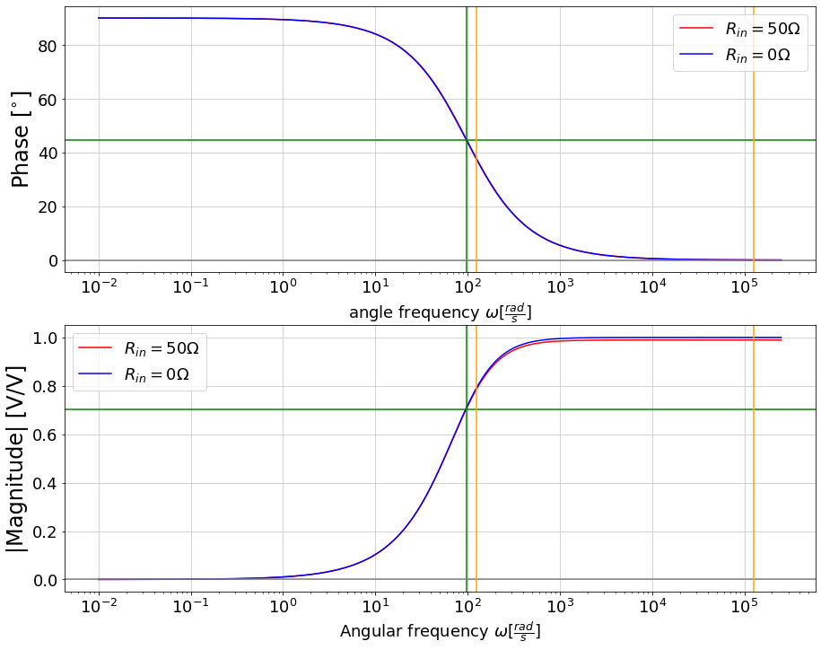
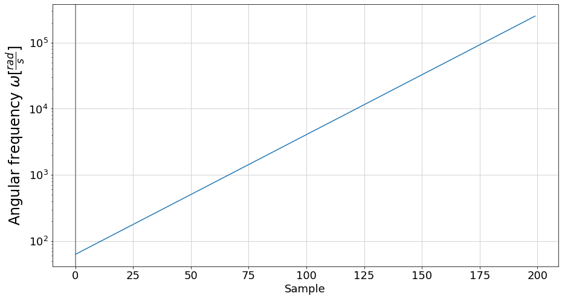

# Electronics

In this article it will be explained how to choose values of passive components to process signal from audio source before being sampled by ADC.

# Circuit theory basics

Before moving to the topic of real circuit, several words about the circuit theory must be written.

When designing blocks of analog filters, several parameters must be considered:
- output impedance of filter,
- input impedance of filter,
- cutoff frequency,
- phase shift.

**Matching output and input impedance** is crucial to obtain useful signal, because if:
- impedance of following block is close to the preceding one, then output voltage will be scaled to half of input voltage,
- impedance of following block is (rule of thumb) 10x greater than preceding impedance, then output voltage will be close to input voltage.

## Real voltage source

Let's consider basic circuit made out of ideal voltage source 1V DC with series resistance R2 (real voltage source) loaded with R1 resistor:

|Simple real voltage source with resistive load|
|:-:|
||

When considering resistive load rules can be applied more generally to impedance.

Output voltage is described using voltage divider, so gain (ratio of output and input voltages) is given by formula:


Let's see how gain changes with R1:

|R2|R1|R1/R2|k|
|:-:|:-:|:-:|:-:|
|100R|20R|0.2x|0.17|
|100R|100R|1x|0.5|
|100R|1k|10x|0.91|
|100R|10k|100x|0.99|

The higher R1 the higher gain or output voltage, but it cannot be cranked up freely – output impedance of source and input impedance of receiver must be considered.

## Thevenin's Theorem

Thevenin's theorem says that any linear circuit can be replaced by voltage source and resistance (impedance in general) that behaves in the same way. Equivalent circuit can be modeled using **open circuit voltage** and **short circuit current**.

**Open circuit voltage** can be obtained from voltage divider:


Then **short circuit current** is given by formula:


R1 is shorten so Thevenin's current depends only on **series resistance R2**.

The Thevenin's equivalent resistance is:


Worth mentioning: **voltage gain of this system is not Thevenin's resistance!**

Equivalent circuit is made using:
- new voltage source with Thevenin's voltage value,
- resistor with Thevenin's resistance value.

|Equivalent Thevenin's circuit|
|:-:|
||

To ensure if both circuits are behaving the same way, let's look at output voltage. Thevenin's circuit's output voltage is passed from voltage source without any loss on resistor, because of no current flow. So output voltage is simply:


Let's consider how Thevenin's resistance (called output resistance) vary with R1 and how much current circuit can deliver during short circuit:

|R1|Rth|Uth|Iss| P|
|:-:|:-:|:-:|:-:|:-:|
|20R|16.7R|0.167V|10mA|1.39mW|
|100R|50R|0.5V|10mA|2.5mW|
|1k|91R|0.91V|10mA|0.83mW|
|10k|99R|0.99V|10mA|0.1mW|

As R1 rises, Thevenin's resistance rises to limit given by R2 (R1 is in parallel to R2 so total resistance will never exceed lower of those two) and output voltage also rises sustaining constant short circuit current value. Constant 10mA is consistent with the fact that R1 is shorted, so only R2 counts to the current.

Output resistance varies with R1. Lower output resistance does not mean, that circuit can deliver more power. Despite lower parallel resistance and more current flow, there is lower voltage drop on output. When power deliver to output will be maximised? The table shows power draw by R1 which is evaluated based on power formula:


The most power is transferred when R1 and R2 are equal.

---

Now let's consider equivalent Thevenin's circuit with another resistor R3 = 100R connector to the circuit's output:

|Circuit with R3 added|
|:-:|
||

The goal is to find R1 that maximize power transfer to R3=100R. Because Thevenin's resistance of R1 and R2=100R connection cannot exceed 100R (R2), the most power will be transferred when R1 is close to infinity (open circuit) and thus not influencing parallel connection of R1 and R3. 

So when connecting several blocks, impedance of all blocks should be considered. In general we are limited by 2 impedances:
- source output impedance e.g. 50R,
- receiver impedance e.g. 100k.

|R1|Rth|Uth|IR3|Uout|R13| P3|
|:-:|:-:|:-:|:-:|:-:|:-:|:-:|
|20R|16.7R|0.167V|1.43mA|0.143V|16.7R|0.2mW|
|100R|50R|0.5V|3.33mA|0.33V|50R|1.11mW|
|1k|91R|0.91V|4.76mA|0.47V|91R|2.27mW|
|10k|99R|0.99V|4.97mA|0.497V|99R|2.47mW|

In most cases receivers are buffer circuits made out of op-amps with high input impedance and low output impedance. So to sustain high quality signal all processing blocks should be spread across minimum and maximum impedances.

When audio signal passes to ADC it is required to know how ADC processes signal and thus find out required current draw.

---

Now let's pick R2 = 100R, R1 = 1k and connect several R3 loads. As before Rth = 91R and Uth = 0.91V.

|R1|R3|R13|IR3|Uout|P3|
|:-:|:-:|:-:|:-:|:-:|:-:|
|1k|10|9.91R|9.01mA|0.09V|0.81mW|
|1k|100|90.91R|4.76mA|0.48V|2.28mW|
|1k|1k|500R|0.83mA|0.83V|0.69mW|
|1k|10k|909R|0.09mA|0.9V|0.08mW|

Again, when connecting resistors in parallel (in this case R1 and R3) final resistance will be smaller than the smaller value of those two. Knowing that, it is not recommended to use R3 lower than R1, because R3 becomes lower of those two, and lowers significantly overall parallel resistance.

As pointed before when R3 = Rth power reaches maximum. When R3 rises much higher than output resistance of source (Rth), voltage drop at the output reaches voltage of source (Uth). So again by the rule of thumb 10 times greater resistance for R3 should be choosen. Then overall current draw will be much less (0.99mA) and output voltage is closer to input voltage (0.9V).

---
|Real voltage source with 2 parallel loads|
|:-:|
||

When looking at real voltage source with series impedance and several parallel impedances, the output impedance (or equivalent Thevenin's resistance) can be find out using **parallel connection of all impedances**. The resulting impedance will be **less than the least resistance in parallel** and **greater than least resistance in parallel divided by number of resistors in total**.

Assuming Thevenin's voltage value can be harder because it requires concerning 3 cases:

|Assumptions in estimating impedances values|
|:-:|
||

Worth highlighting, when resistance replacing parallel connection is equal internal resistance of source, then voltage is halved. 

## Summary

When chaining filter blocks the following tips should be considered:
- Impedance of blocks should be higher than output impedance of source and lower than input impednce of receiver.
- Chained blocks should have increasing impedance - factor of 10x should be enough. It grants high output voltage of each block, and lowers overall current draw to be close to current draw caused by the lowest of all impedance.

# Signal preparation

Audio signal can be delivered from both **microphone** or **audio jack**:

|Block schematic of Audio Spectrum Display V1.0|
|:-:|
||

Output signal from microphone can by switched by plugging 3.5mm audio jack to 5 pin socket (having mechanical switch). So both signals from microphone and audio jack should be similar. Only way to make those signals look similar is to add filter between microphone output and switching socket.

|Audio Jack max volume 1kHz | Microphone the same audio source, headphones 1cm from device|
|:-------------------------:|:-------------------------:|
|  |  |

In practice signal from microphone (as stated in datasheet) can be much higher:

|Knocking near microphone - maximal amplitude achieved|
|:-:|
||

Voltage parameters were gathered and comapred in table:

|Parameter|Microphone MAX9814|Audio Jack|
|:-|:-:|:-:|
|DC offset|1.22V|Symetrical 0V|
|Amplitude|1.245V|1.185V|
|V RMS|0.88V|0.84V|
|Gain|Constant 40/50/60dB|Dependant on source|

Signal from microphone should be **high pass filtered** to **remove DC component**. At this stage builtin amplifier is set to maximum 60dB, but there exists option to lower gain in case of clipping. RMS voltage value is similar to audio jack input, a bit higher which combines well with damping of passive filter.

## MAX9814 microphone

Links:
- [Analog Devices IC - MAX9814 datasheet](https://datasheets.maximintegrated.com/en/ds/MAX9814.pdf)
- [Adafruit Module: schematic, EAGLE files](https://github.com/adafruit/Adafruit-MAX9814-AGC-Microphone-PCB)

Selected parameters:
- Supply Voltage: 2.7V to 5.5V 
- Zout: 50R
- Min resistive load: 5k
- Max capacitive load: 200pF
- Max output current 2mA
- Measured DC offset: 1.22V,
- Measured AC RMS voltage: 0.88V.

As indicated earlier the load resistance should be much greater than internal resistance of signal source. In this case it is recommended to use 100 times higher resistance. Module of output filter impedance cannot drop below 5k.

|Typical application of MAX9814|
|:-:|
||

As depicted on the diagram, at he output there is amplifier. In datasheet it is noted, that output cannot be loaded with capacitor greater than 200pF. It refers to stability – additional capacitor is series with internal amplifier resistance brings pole in transfer function, which lowers phase margin of the system. As a result there can occur "ringing" in output signal.  In this system it can be neglected. For more details see [Op Amps Driving Capacitive Loads](https://www.analog.com/en/analog-dialogue/articles/ask-the-applications-engineer-25.html)

## Filter design

High pass filter is needed to remove DC component of the signal. It is indicated in the datasheet:

|DC removal filter from MAX's datasheet|
|:-:|
||

Assumed signal frequency ranges from 20Hz (125rad/s) to 20kHz (125664rad/s). 

High pass RC filter will be used with 3dB angular frequency firstly set to 125rad/s. 3dB frequency called cutoff frequency refers to frequency at which RMS value drops by 3dB which is 1/sqrt(2) = 0.707 [V/V]. 

As closest resistance to 5k, a 4.7k resistor was chosen.
```python
w0 = 125
R1 = 4700
C1 = 1/(R0*w0)
print(C0)
```
Thus resulting capacity is 1.7uF:
>1.7021276595744682e-06

Because 2.2uF capacitor is available, it will be chosen. It's reactance called capacitance is given by formula:


|Capacitance of 2.2uF capacitor|
|:-:|
||

Then new cutoff frequency is **96rad/s**:
```python
C0 = 2.2e-06
w0 = 1/(R0*C0)
print(w0)
```
>96.71179883945841

Including output impedance of signal source:

|RC Filter schematic|
|:-:|
||

### Voltage gain
To find out how voltage varies with frequency finding capacitors impedance is needed:


Hence voltage divider gives:


Which can be simply converted to gain:


```python
ZC1 = -1j/(w_draw*C1)
k = R1/ (R1 + Rin + ZC1)
```

Gain is  complex number, so it can be plotted in complex plane:

|System gain varies with signal angular frequency|
|:-:|
||

At cutoff frequency real and imaginary part are equal:
```python
ZC1_w0 = -1j/(w0*C1)
k_w0 = R1/ (R1 + Rin + ZC1_w0)

print(f"k at cutoff frequency: {k_w0:g} [V/V]")
print(f"magnitude: {np.absolute(k_w0):g} [V/V]")
print(f"phase: {np.angle(k_w0)*180/pi:g} deg")
```
>k at cutoff frequency: 0.494737+0.494737j [V/V] 
>magnitude: 0.699664 [V/V] 
>phase: 45 deg

Phase shift is 45° as expected, but magnitude is not 0.707. That's because 3dB refers to filter block consisting of 2 components. In this case internal resistance is taken into account, without it results are as predicted:
>k at cutoff frequency: 0.5+0.5j [V/V] 
>magnitude: 0.707107 [V/V] 
>phase: 45 deg

|System gain with internal resistance (red) and without (blue)|
|:-:|
||

More information can be obtained by splitting complex plot into two separate parts in function of angular frequency:
- magnitude plot,
- phase plot.

|System gain: phase and magnitude|
|:-:|
||


## Capacitor reactance

Capacitor reactance which is imaginary part of complex capacitor's impedance is given by formula:


Generate angular frequency Numpy array:

```python
def gen_w_array(min_f=20, max_f=20000, steps=100):
  min_w = 2*pi*min_f
  max_w = 2*pi*max_f

  exp_a = min_w
  exp_b = (max_w/exp_a)**(1/(steps-1))

  w = exp_a*exp_b**np.arange(0,steps)
  return w

w = gen_w_array(min_f = 0.1, max_f = 40000, steps = 200)
```
Samples are exponentially distributed:

|Frequencyrange 20Hz (125rad/s) to 20kHz(125664rad/s)|
|:-:|
||

Capacitance (capacitorreactances) ranges from 10k to 8R:

|Capacitance of 1.6 uF capacitor|
|:-:|
||

## Output impedance

To have better look on this circuit Thevenin theore can be used. It requires finding open circuit voltage and short circuit current and then dividing them to find out complex impedance.

Voltage source can be described as time dependant voltage:


or using notation with complex voltage:


DC part will be trimmed, cosine part is lets say frozen so that final phasor in complex plane is rotated by phase shift and scaled by RMS voltage or amplitude (in this case).

Output voltage can be find out using voltage divider:


During short circuit R0 is excluded and final current is:


Final Thevenin resistance is:


```python
ZC0 = -1j/(w*C0)
U_th = U * R0 /(R0 + Rin + ZC0)
I_th = U / (Rin + ZC0)
Z_th = R0 * (Rin + ZC0) / (R0 + Rin + ZC0)
```
Both voltage and current canbe plotted:

|Thevenin voltage in V | Thevenin current in A|
|:-------------------------:|:-------------------------:|
|  |  |

Ratio between voltage and current is impedance and it describes both:
- magnitud: how many times voltage is greater than current
- phase: how current is shifted relative to current.

warto zauwazyc ze modul impedancji jest wieksza niz dla uproszczenia samej kapacytancji

# Audio Jack

Wstep do elektroniki - schemat blokowy i opiskazdego bloku


Coming coon


<!--stackedit_data:
eyJoaXN0b3J5IjpbLTk5MjYxNzAwMywyMDA0NDU3NjM0LDEwMz
AxMTM5ODIsMTcyMzU4MDY1OSwxNTY1NzU1MDYxLDYyODIzMjIs
LTU2NzkzMTk1LC0zODM2NzIxNjUsMTc0NzAxOTgwNiwtNTM1Mj
MyMjQwLDQ2MjAxMDAwOSwxMjM5NDY2MTU5LC0xMzk4MzI2NzQ5
LDY4MTM2NTIzMiwtMTYzMjkxNzk0NywtMTg3MDc1OTkxLDEyMD
c3MDk0NTAsOTQ5NTMwODgwLDQ5ODM5NTEsMTE5ODUwNTYwMF19

-->
